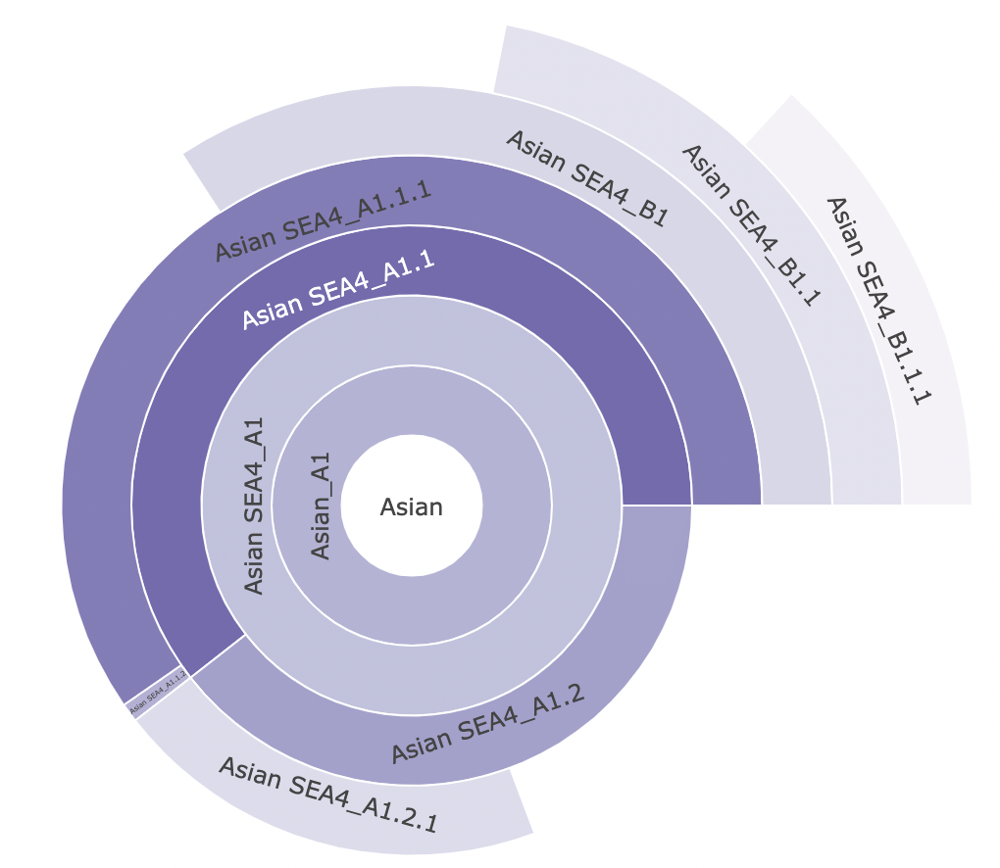
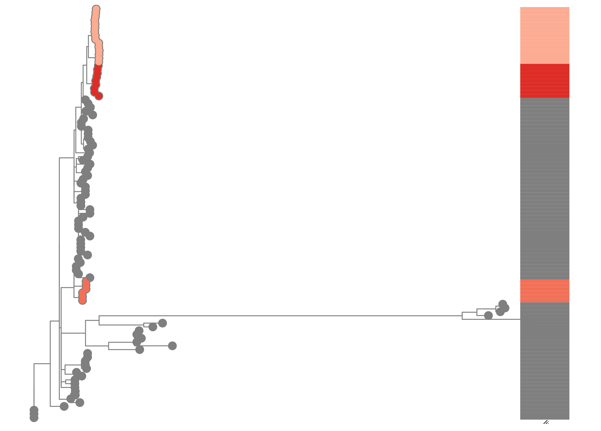

```{r setup, include=FALSE}
knitr::opts_chunk$set(echo = TRUE)

```

```{r setting, message = FALSE, warning = FALSE, echo = FALSE}

library(dplyr)
library(ggplot2)
library(knitr)

sequence_data<-read.csv("sequence_data.csv")
metadata<-read.csv("metadata_4B.csv")

relevant_lineages<-read.csv("relevant_lineages.csv")

new_lineages<-read.csv("new_lineages.csv")

```

```{css, echo=FALSE}
h1, h2{
  text-align: center;
  font-family: Helvetica;
  font-weight: bold;
}

body{
  margin-top: 75px;
  font-family: Helvetica;
  font-weight: lighter;
  font-size: 14pt;
}

```

$~$

## Study Overview

$~$
$~$

```{r general info, echo=FALSE, warning=FALSE, message=FALSE, results='asis'}

cat(paste("This study contains ", length(sequence_data$ID), " sequences from between ", min(sequence_data$year), " and ", max(sequence_data$year), ".", sep = ""))

cat(paste("This sequence data came from", length(unique(metadata$place)), "different places. "))

regions<-data.frame(region=unique(metadata$place), count=NA)

for (i in 1:length(regions$region)) {
  regions$count[i]<-length(which(metadata$place == regions$region[i]))
}

names(regions)<-c("Place", "Number of Sequences")

kable(regions, row.names=F)
```
<strong>**Table 1.** Numbers of sequences by province. </strong>


$~$
$~$


$~$

```{r hosts, echo=FALSE, warning=FALSE, message=FALSE, results='asis'}
cat(paste("This sequence data came from", length(unique(metadata$species)), "different hosts. "))

hosts<-data.frame(host=unique(metadata$species), count=NA)

for (i in 1:length(hosts$host)) {
  hosts$count[i]<-length(which(metadata$species == hosts$host[i]))
}

cat(paste(round(((hosts$count[grep("Canis familiaris", hosts$host)])/sum(hosts$count))*100, digits = 2)), "% of these are from dogs.", sep = "")

names(hosts)<-c("Host", "Number of Sequences")


kable(hosts, row.names=F)
```

<strong>**Table 2.** Numbers of sequences from different hosts. </strong>

```{r hosts2, echo=FALSE, warning=FALSE, message=FALSE, results='asis'}


ggplot(metadata, aes(x = lineage, fill = species)) + 
  geom_bar() +
  theme(axis.text.x = element_text(angle = 90, vjust = 0.5, hjust=1))
```

<strong>**Figure 1.** Host numbers by lineage </strong>

\newpage


## Lineages Overview


$~$
$~$

Several well-defined RABV clades circulate globally, within two major phylogenetic groups; bat-related and dog-related. The dog-related group is split into 6 different clades according to Troupin et al. (2016). These clades are: Africa 2, Africa 3, Cosmopolitan, Arctic, Asian and Indian. The majority of Nigerian sequences fall within the Africa 2 clade.


$~$

The MAD DOG (Method for Assignment, Definition and Designation Of Global lineages) tool is an updated lineage designation and assignment tool for rabies virus based on the dynamic nomenclature used for SARS-CoV-2 by Rambaut et al. (2020). This tool defines sequences beyond the clade and subclade level, allowing increased definition. Application of this tool can be used to generate detailed information to inform control efforts and monitor progress towards the elimination of rabies virus.

$~$

Details of the tool can be found at https://doi.org/10.5281/zenodo.5503916

$~$

For more information see: https://doi.org/10.1371/journal.ppat.1010023

$~$


$~$
$~$
\newpage
```{r lineage info, echo=FALSE, warning=FALSE, message=FALSE, results='asis'}
cat(paste("Overall", length(unique(sequence_data$lineage)), "lineages have been detected in this study.", (length(relevant_lineages$lineage)+length(new_lineages$lineage)) - length(unique(sequence_data$lineage)), "lineages are included here that have not been seen in this study, but are direct parents of lineages in this study, so are included for relevant evolutionary investigations."))

cat(paste("There are ", length(relevant_lineages$lineage), " existing lineages relevant to this study."))
kable(relevant_lineages[,-c(1,7)], row.names=F)
```
**Table 3.** Details of lineages relevant to this study. First and last years refer to the first and most recent years the lineage has been detected. 

```{r lineage new, echo=FALSE, warning=FALSE, message=FALSE, results='asis'}
if(length(new_lineages) != 0) {
  cat(paste("There are ", length(new_lineages$lineage), " new lineages identified in this dataset."))
  kable(new_lineages[,-c(6)], row.names=F)
} else {
  cat(paste("There are no new lineages identified in this dataset."))
}
```
**Table 4.** Details of new lineages identified in this study. First and last years refer to the first and most recent years the lineage has been detected. 




<strong>**Figure 2.** Sunburst plot showing evolutionary relationships of lineages </strong>


<strong>**Figure 3.** Maximum likelihood tree with tips coloured by lineage, and bar showing lineage positions </strong>


\newpage

## Lineage Changes Over Time

```{r lineage_years, echo=FALSE, warning=FALSE, message=FALSE, results='asis'}
cat(paste("The sequences span ", as.integer(max(sequence_data$year)) - as.integer(min(sequence_data$year)), " years from ", min(sequence_data$year), " to ", max(sequence_data$year),". ", sep = ""))

getmode <- function(v) {
   uniqv <- unique(v)
   uniqv[which.max(tabulate(match(v, uniqv)))]
}

cat(paste("The year with the greatest number of sequences is ", getmode(sequence_data$year), " with ", length(which(sequence_data$year == getmode(sequence_data$year))), " sequences."))

cat(paste("The most prevalent lineage is ", getmode(sequence_data$lineage), " with ", length(which(sequence_data$lineage == getmode(sequence_data$lineage))), " sequences."))
```

```{r years_graph, echo=FALSE, warning=FALSE, message=FALSE, results='asis', fig.width=7, fig.height=7}

data_sub<-sequence_data

graph<-ggplot(data_sub, aes(x = year, fill = lineage)) + 
  geom_bar() + theme(legend.position = "bottom") + theme(axis.text.x = element_text(size = 7)) + 
  theme(legend.position="none") +
  theme(axis.title.x=element_blank()) 
lin<-data.frame(table(data_sub$lineage))
names(lin)<-c("lineage", "count")
pie<-ggplot(lin, aes(x="", y=count, fill=lineage)) +
  geom_bar(stat="identity", width=1, color="white") +
  coord_polar("y", start=0) +
  theme_void()+   theme(legend.position="right") + theme(legend.text = element_text(size=7)) +theme(legend.key.size = unit(0.45,"cm"))+theme(legend.title = element_blank())
gridExtra::grid.arrange(graph,pie)
```
$~$

**Figure 4.** *Above:* Number of sequences per year, with bars split by lineage. *Below:* Pie chart indicating proportions of lineages. All lineages are prefixed by the clade.

## Sequence Locations

<strong>**Figure 5.** Locations of samples included in the study</strong>

