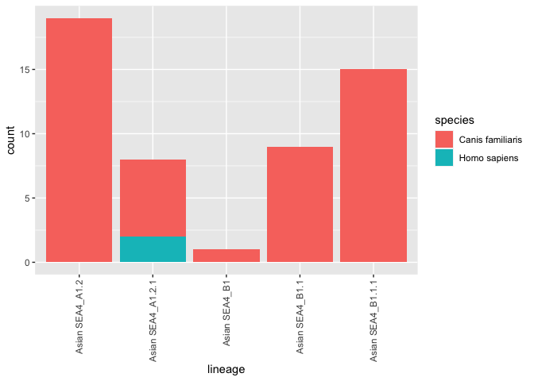
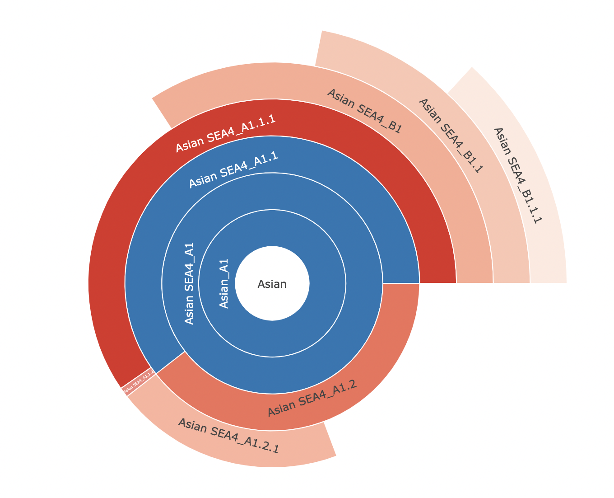
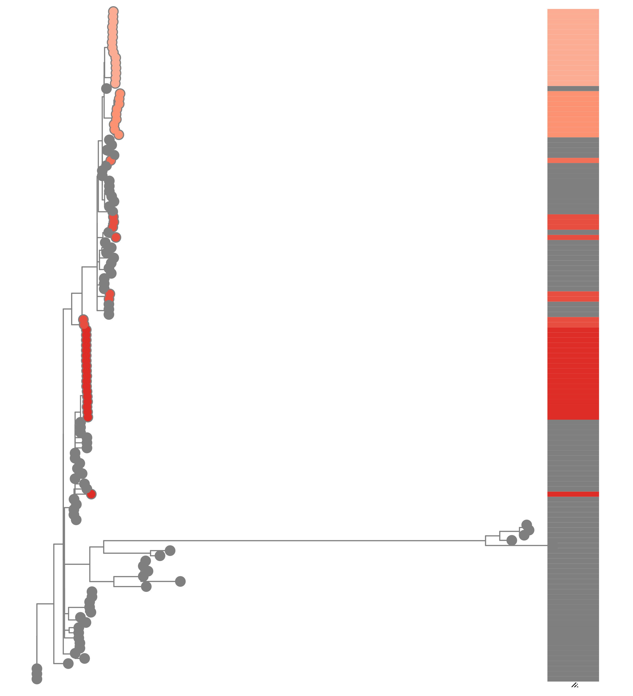
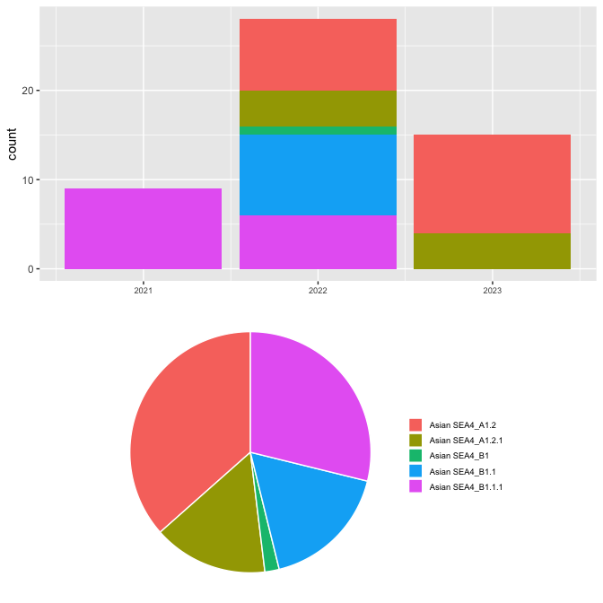
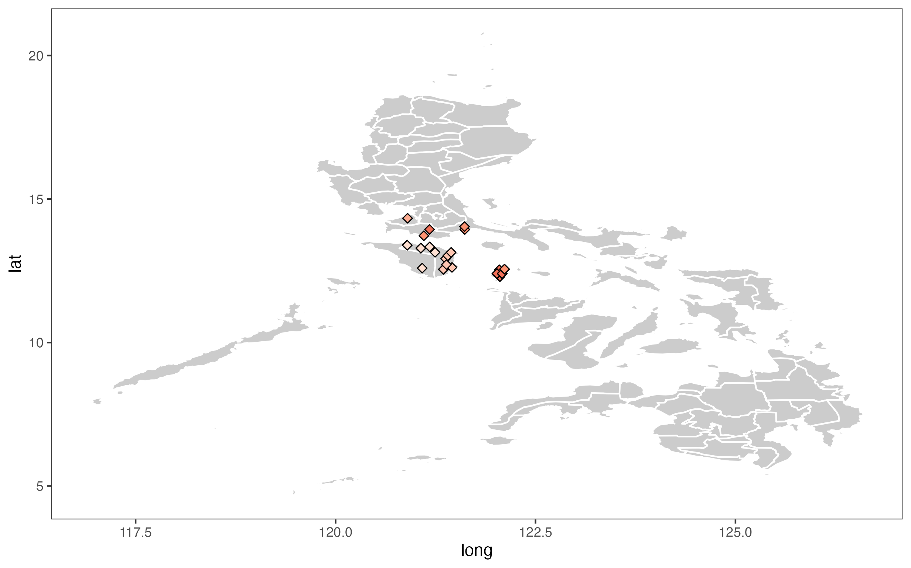

$~$

## Study Overview

$~$
$~$

This study contains 52 sequences from between 2021 and 2023.This sequence data came from 21 different places. 

|Place         | Number of Sequences|
|:-------------|-------------------:|
|Lipa          |                   1|
|General Trias |                   1|
|Lucena City   |                   1|
|Batangas City |                   1|
|Tayabas       |                   1|
|Calapan       |                   2|
|Victoria      |                   1|
|Puerto Galera |                   5|
|Baco          |                   6|
|Mansalay      |                   3|
|Bongabong     |                   2|
|Gloria        |                   1|
|Pinamalayan   |                   1|
|Pola          |                   1|
|Roxas         |                   1|
|Alcantara     |                   3|
|Odiongan      |                   7|
|Santa Maria   |                   7|
|San Agustin   |                   5|
|San Andres    |                   1|
|Calintaan     |                   1|
<strong>**Table 1.** Numbers of sequences by province. </strong>

$~$
$~$

$~$

This sequence data came from 2 different hosts. 96.15% of these are from dogs.

|Host             | Number of Sequences|
|:----------------|-------------------:|
|Canis familiaris |                  50|
|Homo sapiens     |                   2|

<strong>**Table 2.** Numbers of sequences from different hosts. </strong>

<!-- -->

<strong>**Figure 1.** Host numbers by lineage </strong>

\newpage

## Lineages Overview

$~$
$~$

Several well-defined RABV clades circulate globally, within two major phylogenetic groups; bat-related and dog-related. The dog-related group is split into 6 different clades according to Troupin et al. (2016). These clades are: Africa 2, Africa 3, Cosmopolitan, Arctic, Asian and Indian. The majority of Philippine sequences fall within the Asian clade.

$~$

The MAD DOG (Method for Assignment, Definition and Designation Of Global lineages) tool is an updated lineage designation and assignment tool for rabies virus based on the dynamic nomenclature used for SARS-CoV-2 by Rambaut et al. (2020). This tool defines sequences beyond the clade and subclade level, allowing increased definition. Application of this tool can be used to generate detailed information to inform control efforts and monitor progress towards the elimination of rabies virus.

$~$

Details of the tool can be found at https://doi.org/10.5281/zenodo.5503916

$~$

For more information see: https://doi.org/10.1371/journal.ppat.1010023

$~$

$~$
$~$
\newpage
Overall 5 lineages have been detected in this study. 2 lineages are included here that have not been seen in this study, but are direct parents of lineages in this study, so are included for relevant evolutionary investigations.There are  3  existing lineages relevant to this study.

|country     | year_first| year_last| n_seqs|parent          |
|:-----------|----------:|---------:|------:|:---------------|
|Philippines |       2012|      2016|     29|Asian SEA4_A1.1 |
|Philippines |       2013|      2019|      1|Asian SEA4_A1.1 |
|Philippines |       2012|      2019|     22|Asian SEA4_A1   |
**Table 3.** Details of lineages relevant to this study. First and last years refer to the first and most recent years the lineage has been detected. 

There are  4  new lineages identified in this dataset.

|lineage           |country                   | year_first| year_last| n_seqs|
|:-----------------|:-------------------------|----------:|---------:|------:|
|Asian SEA4_A1.2.1 |c("Japan", "Philippines") |       2006|      2023|     23|
|Asian SEA4_B1     |Philippines               |       2012|      2022|     14|
|Asian SEA4_B1.1   |Philippines               |       2012|      2022|     10|
|Asian SEA4_B1.1.1 |Philippines               |       2021|      2022|     15|
**Table 4.** Details of new lineages identified in this study. First and last years refer to the first and most recent years the lineage has been detected. 

<strong>**Figure 2.** Sunburst plot showing evolutionary relationships of lineages </strong>

<strong>**Figure 3.** Maximum likelihood tree with tips coloured by lineage, and bar showing lineage positions </strong>

\newpage

## Lineage Changes Over Time

The sequences span 2 years from 2021 to 2023. The year with the greatest number of sequences is  2022  with  28  sequences.The most prevalent lineage is  Asian SEA4_A1.2  with  19  sequences.

<!-- -->
$~$

**Figure 4.** *Above:* Number of sequences per year, with bars split by lineage. *Below:* Pie chart indicating proportions of lineages. All lineages are prefixed by the clade.

## Sequence Locations

<strong>**Figure 5.** Locations of samples included in the study</strong>

