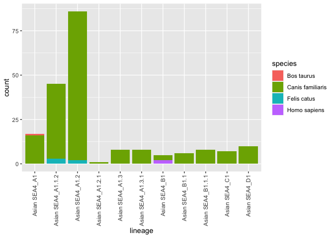
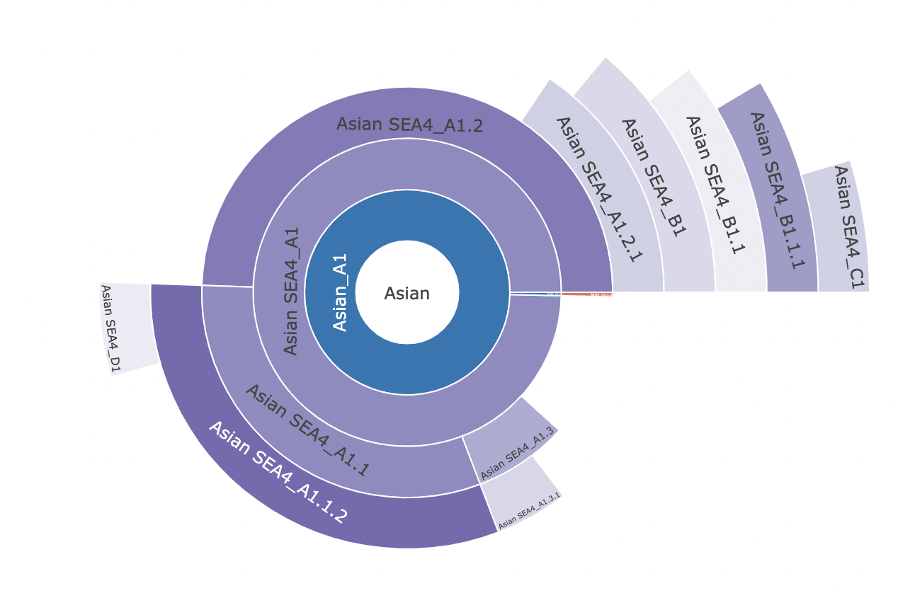
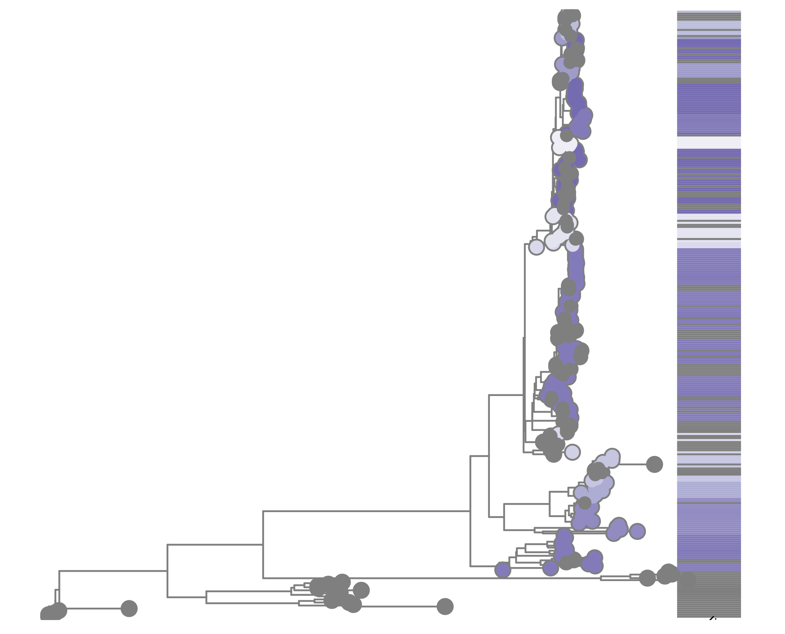
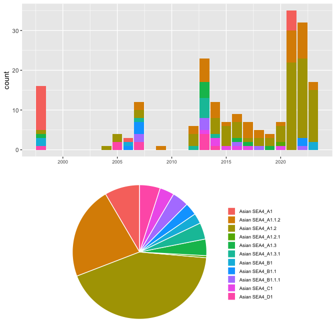
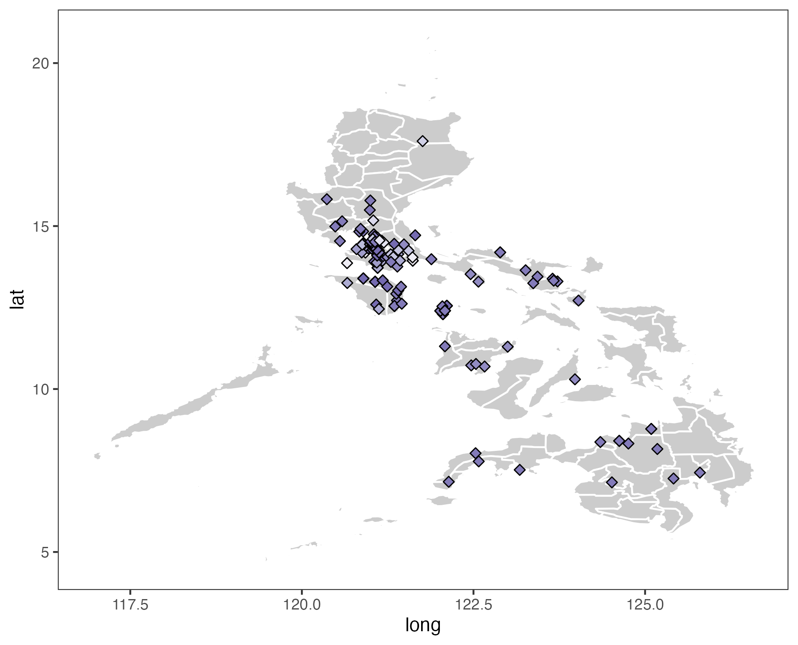

$~$

## Study Overview

$~$
$~$

This study contains 201 sequences from between 1998 and 2023.This sequence data came from 125 different places. 

|Place          | Number of Sequences|
|:--------------|-------------------:|
|Alaminos       |                   1|
|Alcantara      |                   3|
|Amadeo         |                   1|
|Angeles        |                   1|
|Angono         |                   2|
|Atimonan       |                   1|
|Baco           |                   6|
|Bacoor         |                   1|
|Bacoor         |                   3|
|Batangas       |                   5|
|Binan          |                   2|
|Binangonan     |                   1|
|Bongabong      |                   2|
|Buenavista     |                   1|
|Cabanatuan     |                   1|
|Cabuyao        |                   1|
|Cagayan de Oro |                   2|
|Cagayan de Oro |                   1|
|Calamba        |                   2|
|Calamba        |                   1|
|Calamba        |                   2|
|Calapan        |                   2|
|Calatagan      |                   1|
|Calauan        |                   1|
|Calintaan      |                   1|
|Caloocan       |                   2|
|Candelaria     |                   1|
|Carmona        |                   1|
|Cavinti        |                   1|
|Cavite         |                   2|
|Cuenca         |                   1|
|Dasmarinas     |                   1|
|Dasmarinas     |                   1|
|Davao          |                   1|
|Floridablanca  |                   1|
|General Trias  |                   7|
|Gingoog        |                   2|
|Gloria         |                   1|
|GMA            |                   2|
|Guiginto       |                   1|
|Imus           |                   2|
|Imus           |                   1|
|Indang         |                   1|
|Infanta        |                   1|
|Ipil           |                   1|
|Iriga          |                   1|
|Irosin         |                   1|
|Kawit          |                   1|
|Labason        |                   1|
|Lapu lapu      |                   1|
|Las Pinas      |                   1|
|Las Pinas      |                   4|
|Libon          |                   1|
|Libona         |                   1|
|Limay          |                   1|
|Lipa           |                   1|
|Lipa           |                   2|
|Lucena         |                   1|
|Lucena         |                   1|
|Makati         |                   1|
|Malaybalay     |                   1|
|Malilipot      |                   1|
|Malinao        |                   1|
|Malolos        |                   1|
|Mamburao       |                   1|
|Mansalay       |                   3|
|Manticao       |                   1|
|Marikina       |                   1|
|Midsayap       |                   1|
|Mulanay        |                   1|
|Muntinlupa     |                   1|
|Muntinlupa     |                   1|
|Muntinlupa     |                   5|
|Naga           |                   1|
|Nagcarlan      |                   1|
|Naic           |                   1|
|Noveleta       |                   1|
|Odiongan       |                   7|
|Oton           |                   1|
|Paranaque      |                   2|
|Paranaque      |                   1|
|Pasay          |                   2|
|Pavia          |                   1|
|Pililla        |                   1|
|Pinamalayan    |                   2|
|Pola           |                   1|
|Puerto Galera  |                   4|
|Puerto Galera  |                   1|
|Pulilan        |                   1|
|Quezon         |                   1|
|Roxas          |                   1|
|Sagun          |                   1|
|San Agustin    |                   5|
|San Andres     |                   1|
|San Antonio    |                   1|
|San Francisco  |                   1|
|San Jose       |                   2|
|San Jose       |                   1|
|San Juan       |                   1|
|San Juan       |                   1|
|San Miguel     |                   1|
|San Pablo      |                   1|
|San Pablo      |                   2|
|San Pedro      |                   1|
|Santa Maria    |                   7|
|Sara           |                   1|
|Siniloan       |                   1|
|Sta Cruz       |                   1|
|Sta. Cruz      |                   3|
|Sta. Rosa      |                   2|
|Sta. Rosa      |                   2|
|Sto. Tomas     |                   1|
|Tabaco         |                   1|
|Taguig         |                   3|
|Taguig         |                   4|
|Tagum          |                   1|
|Tanauan        |                   2|
|Tayabas        |                   1|
|Taytay         |                   1|
|Tibiao         |                   1|
|Tuguegarao     |                   1|
|Urbiztondo     |                   1|
|Victoria       |                   1|
|Vinzons        |                   2|
|Zamboanga      |                   1|
<strong>**Table 1.** Numbers of sequences by province. </strong>

$~$
$~$

$~$

This sequence data came from 4 different hosts. 96.02% of these are from dogs.

|Host             | Number of Sequences|
|:----------------|-------------------:|
|Canis familiaris |                 193|
|Felis catus      |                   5|
|Bos taurus       |                   1|
|Homo sapiens     |                   2|

<strong>**Table 2.** Numbers of sequences from different hosts. </strong>

<!-- -->

<strong>**Figure 1.** Host numbers by lineage </strong>

\newpage

## Lineages Overview

$~$
$~$

Several well-defined RABV clades circulate globally, within two major phylogenetic groups; bat-related and dog-related. The dog-related group is split into 6 different clades according to Troupin et al. (2016). These clades are: Africa 2, Africa 3, Cosmopolitan, Arctic, Asian and Indian. The majority of Philippine sequences fall within the Asian clade.

$~$

The MAD DOG (Method for Assignment, Definition and Designation Of Global lineages) tool is an updated lineage designation and assignment tool for rabies virus based on the dynamic nomenclature used for SARS-CoV-2 by Rambaut et al. (2020). This tool defines sequences beyond the clade and subclade level, allowing increased definition. Application of this tool can be used to generate detailed information to inform control efforts and monitor progress towards the elimination of rabies virus.

$~$

Details of the tool can be found at https://doi.org/10.5281/zenodo.5503916

$~$

For more information see: https://doi.org/10.1371/journal.ppat.1010023

$~$

$~$
$~$
\newpage
Overall 11 lineages have been detected in this study. 1 lineages are included here that have not been seen in this study, but are direct parents of lineages in this study, so are included for relevant evolutionary investigations.There are  4  existing lineages relevant to this study.

|country                   | year_first| year_last| n_seqs|parent          |
|:-------------------------|----------:|---------:|------:|:---------------|
|China                     |       1994|      2015|      1|Asian_A1.1      |
|Philippines               |       2013|      2019|     74|Asian SEA4_A1.1 |
|Philippines               |       2012|      2019|     95|Asian SEA4_A1   |
|c("Japan", "Philippines") |       1994|      2020|     32|Asian_A1        |
**Table 3.** Details of lineages relevant to this study. First and last years refer to the first and most recent years the lineage has been detected. 

There are  8  new lineages identified in this dataset.

|lineage           |country                   | year_first| year_last| n_seqs|
|:-----------------|:-------------------------|----------:|---------:|------:|
|Asian SEA4_B1.1.1 |Philippines               |       2007|      2022|     11|
|Asian SEA4_A1.3   |Philippines               |       1998|      2019|      8|
|Asian SEA4_C1     |Philippines               |       2013|      2020|     13|
|Asian SEA4_A1.3.1 |Philippines               |       1994|      2017|     13|
|Asian SEA4_A1.2.1 |c("Japan", "Philippines") |       1994|      2020|      5|
|Asian SEA4_B1     |Philippines               |       1994|      2023|      9|
|Asian SEA4_D1     |c("Japan", "Philippines") |       1998|      2015|     14|
|Asian SEA4_B1.1   |Philippines               |       2006|      2022|      6|
**Table 4.** Details of new lineages identified in this study. First and last years refer to the first and most recent years the lineage has been detected. 

<strong>**Figure 2.** Sunburst plot showing evolutionary relationships of lineages </strong>

<strong>**Figure 3.** Maximum likelihood tree with tips coloured by lineage, and bar showing lineage positions </strong>

\newpage

## Lineage Changes Over Time

The sequences span 25 years from 1998 to 2023. The year with the greatest number of sequences is  2021  with  35  sequences.The most prevalent lineage is  Asian SEA4_A1.2  with  86  sequences.

<!-- -->
$~$

**Figure 4.** *Above:* Number of sequences per year, with bars split by lineage. *Below:* Pie chart indicating proportions of lineages. All lineages are prefixed by the clade.

## Sequence Locations

<strong>**Figure 5.** Locations of samples included in the study</strong>

